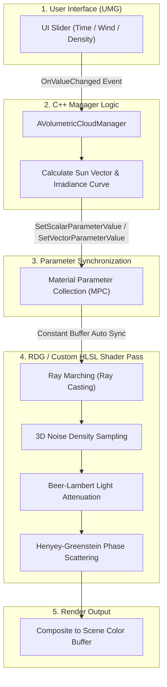
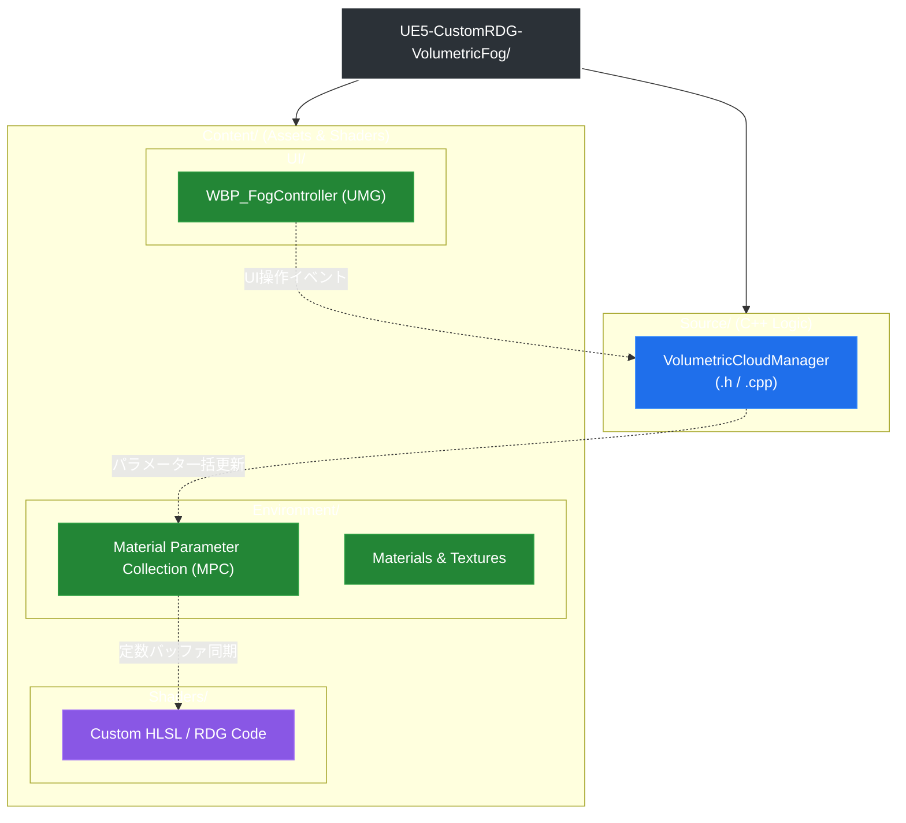

# UE5 Custom RDG Volumetric Fog & Environment Control System

Unreal Engine 5のRDG（Render Dependency Graph）を用いたボリュメトリックフォグ/クラウドシェーダーと、C++・UMGによるリアルタイム環境操作UIを統合したグラフィックスデモプロジェクトです。

---

## 目次 (Table of Contents)

- [動作デモ (Demo)](#-動作デモ-demo)
- [プロジェクト開発目的](#プロジェクト開発目的)
- [プロジェクト概要](#プロジェクト概要)
- [主な機能 \& 技術的ハイライト](#主な機能--技術的ハイライト)
- [システム構成・使用技術](#システム構成使用技術)
- [レンダリングフロー・データパイプライン](#レンダリングフローデータパイプライン)
- [使い方 (Usage)](#使い方-usage)
  - [動作環境](#動作環境)
  - [実行方法 (パッケージ版)](#実行方法-パッケージ版)
  - [エディタでの導入・ビルド手順](#エディタでの導入ビルド手順)
- [ディレクトリ構成](#ディレクトリ構成)
- [注意事項・ライセンス](#注意事項ライセンス)

---

## 📹 動作デモ (Demo)

https://github.com/atushi3110/UE5-CustomRDG-VolumetricFog/releases/download/v1.0.0/VolumetricFogDemo.mp4<br>
*※ UIスライダー操作によるリアルタイムな時刻変化、雲量・風速制御および動的ライティングの挙動*

### 画面説明および操作内容
画面下部の操作UI（UMG）により、リアルタイムでパラメータを変更・確認できます。

* **Time of Day (時刻制御 / 00:00〜01:21)**:<br>
スライダー操作に応じて太陽の角度とライティングが変化します。<br>夕方から夜間にかけての暗転や、早朝の朝焼け・ライティングの推移がスムーズに描画されます。
* **Wind Speed (風速制御 / 00:30〜00:48)**:<br>
スライダー値を変更することで、3Dノイズのオフセット速度が変化し、雲の流れが加減速します。
* **Cloud Coverage (雲量制御 / 00:50〜01:18)**:<br>
密度閾値をリアルタイムに変更し、快晴に近い状態から厚い雲で覆われた状態まで動的にコントロールできます。

---

## プロジェクト開発目的

本プロジェクトは、標準機能（Volumetric Cloudコンポーネント等）に頼らず、**「グラフィックスパイプラインの深い理解と自作シェーダーによる独自表現の実装」** を目標として開発しました。

1. **カスタムパイプラインの理解**:<br>Render Dependency Graph (RDG) を使用し、UE5のレンダーパイプラインに独自のカスタムHLSLシェーダーパスを安全かつ低負荷で統合する技術の検証。
2. **物理ベースのボリューム描画自作**:<br>レイマーチングアルゴリズム、3Dノイズ生成、およびBeer-Lambert則に基づく光散乱計算をゼロからHLSLで構築する表現力の追求。
3. **低遅延なリアルタイム制御**:<br>アプリケーション実行時に、UI（UMG）からの操作入力をC++およびMaterial Parameter Collection (MPC) を経由して描画パスへ即座に反映させる実践的なアーキテクチャ設計。

---

## プロジェクト概要

本プロジェクトは、UE5の標準ボリュメトリック機能に依存せず、**カスタムHLSLおよびRDG（Render Dependency Graph）を用いて独自にレイマーチング（Ray Marching）およびライティング計算を実装したボリュメトリッククラウド/フォグシステム**です。

レイマーチングによる密度サンプリング、3Dノイズ（Perlin / Worley Noise）を用いた形状生成、ならびにBeer-Lambertの法則に基づく光の減衰計算をすべて自前のシェーダーコードで算出しています。<br>
さらに、この独自シェーダーのパラメータを C++ アクター（`AVolumetricCloudManager`）および Material Parameter Collection (MPC) を介して制御し、パッケージ実行環境下でユーザーが画面上のUIスライダーからリアルタイムに環境操作（時刻・風速・雲量）できる統合アーキテクチャを構築しました。

---

## 主な機能 & 技術的ハイライト

- **自作レイマーチング・シェーダー (Custom Ray Marching)**:
  - カメラ視点からのレイキャスティングとレイステップ毎の密度サンプリングアルゴリズムを自前で計算。
  - 3Dノイズ合成（Worley / Perlin Noise）によるリアルな雲の立体形状・細部のディテール生成。
- **物理ベースのライティング計算 (Volumetric Lighting)**:
  - **Beer-Lambertの法則**に基づくレイステップ毎の光の透過・減衰計算。
  - 太陽光の異方性散乱（Phase Function / Henyey-Greenstein関数）による逆光・順光表現の自作実装。
- **動的ライティング＆時刻連動 (Time of Day)**:
  - 0:00〜24:00の時刻変化に応じて、自作シェーダーへ渡す太陽方向ベクトルおよび放射照度（Irradiance）を補間更新（`HH:MM` デジタル表記対応）。
- **C++ / RDG / UMG リアルタイム連携アーキテクチャ**:
  - UIスライダーの操作結果を C++（`AVolumetricCloudManager`）が受け取り、MPC経由で自作シェーダーへ即時伝達・再描画する低遅延な制御設計。

---

## システム構成・技術要素

- **Shader / Graphics Pipeline**: 
  - **Custom HLSL / RDG (Render Dependency Graph)**
  - Ray Marching Algorithm
  - 3D Worley & Perlin Noise Generator
  - Beer-Lambert Law & Henyey-Greenstein Phase Function
- **Engine / Architecture**:
  - Unreal Engine 5.x (C++ Project)
  - Material Parameter Collection (MPC)
  - UMG (Widget Blueprint / C++ Binding)

---

## レンダリングフロー・データパイプライン

本システムにおけるユーザー入力から最終フレーム描画までの処理の流れです。


    
---

## 使い方 (Usage)

### 動作環境
- **OS**: Windows 10 / 11 (64-bit)
- **GPU**: DirectX 12 対応グラフィックボード

### 実行方法 (パッケージ版)
1. リポジトリ右側の **[Releases]** ページから最新の `VolumetricFog_Windows_Build.zip` をダウンロードします。
2. ダウンロードした ZIP ファイルを解凍します。
3. フォルダ内の `VolumetricFog.exe` を実行すると、デモが起動します。

### エディタでの導入・ビルド手順
1. 本リポジトリをクローンします：
   ```bash
   git clone https://github.com/atushi3110/UE5-CustomRDG-VolumetricFog.git
2. UE5-CustomRDG-VolumetricFog.uproject を右クリックし、Generate Visual Studio project files を実行します。
3. 生成された .sln ファイルを Visual Studio 2022 で開き、Development Editor 構成でビルドします。
4. Unreal Editor を起動し、メインレベルを開いて Play または Platforms > Package Project を実行します。
---

## ディレクトリ構成

<details>
<summary>テキスト形式のディレクトリ一覧を表示</summary>

```text
UE5-CustomRDG-VolumetricFog/
├── Config/                      # プロジェクトおよびプラットフォーム設定ファイル
├── Content/                     # プロジェクトのアセットフォルダ
│   ├── Environment/             # マテリアル、MPC、カラーカーブ等
│   ├── Shaders/                 # カスタムHLSL / RDGシェーダー関連コード
│   └── UI/                      # WBP_FogController (UMGウィジェット)
├── Source/                      # C++ ソースコード
│   └── VolumetricFog/
│       ├── VolumetricCloudManager.h   # 環境統括C++アクター (MPC/時刻制御)
│       └── VolumetricCloudManager.cpp
├── build/                       # パッケージ出力先 (Windowsビルド成果物 / .gitignore対象)
├── README.md                    # 本ドキュメント
└── UE5-CustomRDG-VolumetricFog.uproject
```

</details>


    
---

## 注意事項・ライセンス

### 注意事項 (Disclaimer)
本プロジェクトはポートフォリオおよび技術検証を目的として作成されています。<br>
配布している実行ファイルやお使いの環境での動作保証はいたしかねますのでご了承ください。

### ライセンス (License)
本プロジェクトのソースコードおよびアセットは MIT License のもとで公開されています。<br>商用・非商用を問わず自由にご利用いただけます。
